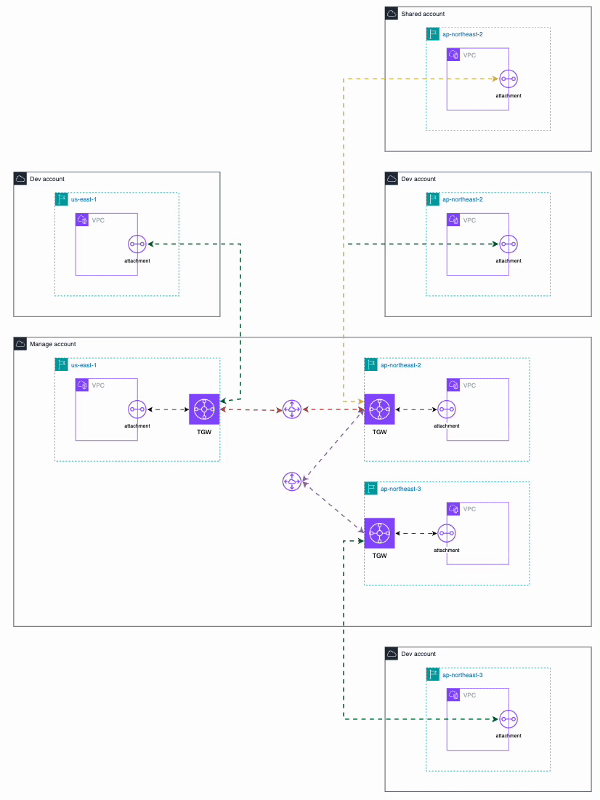

## Account
- manage: 692806374063
- shared: 202949997891
- dev: 558846430793


## Network
### manage-ue1 VPC
`vpc-0e72171581e48f648`  
vpc_cidr_blocks = {
  primary_cidr_block = "10.5.0.0/16"
}

### manage-ap2 VPC
`vpc-0757c82cafd8aa10b`  
vpc_cidr_blocks = {
  primary_cidr_block = "10.0.0.0/16"
}

### manage-ap3 VPC
`vpc-0afd0a26db53f359c`  
vpc_cidr_blocks = {
  primary_cidr_block = "10.3.0.0/16"
}


### shared-ap2 VPC
`vpc-01a3e793dd47f6e1c`  
vpc_cidr_blocks = {
  primary_cidr_block = "10.10.0.0/16"
}


### dev-ap2 VPC
`vpc-0ca96cd5c37d3bae8`  
vpc_cidr_blocks = {
  primary_cidr_block = "10.20.0.0/16"
}

### dev-ap3 VPC
`vpc-08c081812fdc76212`  
vpc_cidr_blocks = {
  primary_cidr_block = "10.30.0.0/16"
}


### dev-ue1 VPC
`vpc-012e100b29d364995`  
vpc_cidr_blocks = {
  primary_cidr_block = "10.25.0.0/16"
}


## TGW
### manage-ue1 - main (ASN: 64512)

### manage-ap2 - main (ASN: 64533)

### manage-ap3 - main (ASN: 64534)

## 전체 아키텍처 다이어그램
`Simple`  
```
 [manage-ue1 VPC]                                     [manage-ap2 VPC]                                          [manage-ap3 VPC]                                
  10.5.0.0/16                                          10.0.0.0/16                                                10.3.0.0/16                            
       │                                                     │                                                         │
       │                                                     │                                                         │
       │                                                     │                                                         │
       ▼                                                     ▼                                                         ▼
                                                            
  [TGW ue1]        ◄══════════════════════════════►       [TGW ap2]        ◄══════════════════════════════►        [TGW ap3]
(manage account)              Peering                  (manage account)                Peering                  (manage account)

       ▲                                                ▲    ▲     ▲                                                   ▲                                           
       │                                     ┌──────────┘    │     └──────────┐                                        │                                              
       │                                     │               │                │                                        │                                               
       │                                     |               │                │                                        │                        
 [dev-ue1 VPC]                         [dev-ap2 VPC]         │          [shared-ap2 VPC]                          [dev-ap3 VPC]                          
  10.25.0.0/16                          10.20.0.0/16         │            10.10.0.0/16                             10.30.0.0/16                      
                                                       [manage-ap2 VPC]
                                                         10.0.0.0/16  

Routing Path:
  ap3 ↔ ap2 : Direct Peering
  ap3 ↔ ue1 : ap3 → ap2 TGW(Hub) → ue1
  ue1 ↔ ap2 : Direct Peering

Legend:
  │  Same-Account Attachment
  ║  Cross-Account Attachment (via RAM)
  ◄═► TGW Peering
```



