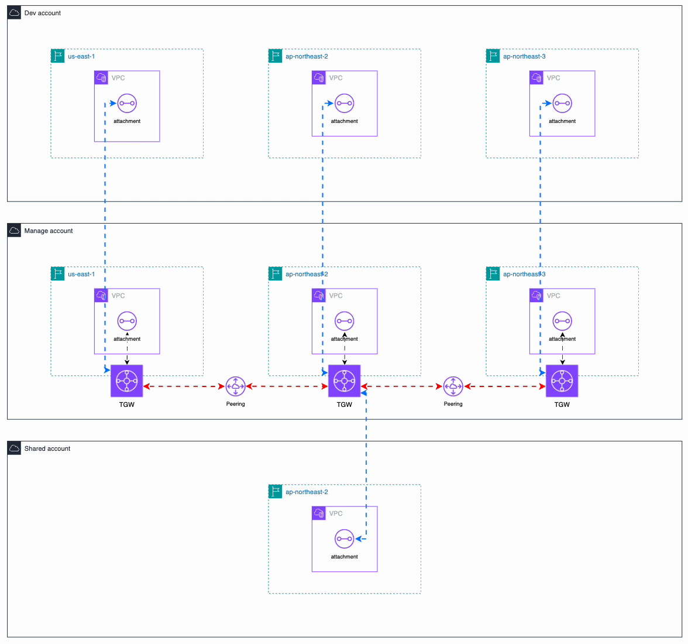

## Account
- manage: 692806374063
- shared: 202949997891
- dev: 558846430793


## Terraform 배포

```
shared 계정 (202949997891) - GitLab Runner 위치
  └── GitlabTerraformRole (Runner EC2 Instance Profile)
        │
        ├── assume → manage 계정 ManageTerraformRole (692806374063)
        ├── assume → dev 계정 DevTerraformRole (558846430793)
        └── assume → shared 계정 SharedTerraformRole (202949997891)

Mac Local 계정 (558846430793) - IAM User(Byoungsoo)
        │
        ├── assume → manage 계정 ManageTerraformRole (692806374063)
        ├── assume → dev 계정 DevTerraformRole (558846430793)
        └── assume → shared 계정 SharedTerraformRole (202949997891)
```

## Resource Naming Rule
#${var.project_code}-${var.account}-${var.aws_region_code}-resource-{az}-{name}

## Network
### manage-use1 VPC
`vpc-0e72171581e48f648`  
vpc_cidr_blocks = {
  primary_cidr_block = "10.5.0.0/16"
}

### manage-apne2 VPC
`vpc-0757c82cafd8aa10b`  
vpc_cidr_blocks = {
  primary_cidr_block = "10.0.0.0/16"
}

### manage-apne3 VPC
`vpc-0afd0a26db53f359c`  
vpc_cidr_blocks = {
  primary_cidr_block = "10.3.0.0/16"
}


### shared-apne2 VPC
`vpc-01a3e793dd47f6e1c`  
vpc_cidr_blocks = {
  primary_cidr_block = "10.10.0.0/16"
}


### dev-apne2 VPC
`vpc-0ca96cd5c37d3bae8`  
vpc_cidr_blocks = {
  primary_cidr_block = "10.20.0.0/16"
}

### dev-apne3 VPC
`vpc-08c081812fdc76212`  
vpc_cidr_blocks = {
  primary_cidr_block = "10.30.0.0/16"
}


### dev-use1 VPC
`vpc-012e100b29d364995`  
vpc_cidr_blocks = {
  primary_cidr_block = "10.25.0.0/16"
}


## TGW
### manage-use1 - main (ASN: 64512)

### manage-apne2 - main (ASN: 64533)

### manage-apne3 - main (ASN: 64534)

## 전체 아키텍처 다이어그램
`Simple`  
```
 [manage-use1 VPC]                                   [manage-apne2 VPC]                                         [manage-apne3 VPC]  
  10.5.0.0/16                                          10.0.0.0/16                                                10.3.0.0/16     
       │                                                     │                                                         │          
       │                                                     │                                                         │          
       │                                                     │                                                         │          
       ▼                                                     ▼                                                         ▼          
                                                                                                                                  
  [TGW ue1]        ◄══════════════════════════════►       [TGW apne2]        ◄══════════════════════════════►     [TGW apne3]      
(manage account)              Peering                  (manage account)                Peering                  (manage account)  
                                                                                                                                  
       ▲                                                ▲          ▲                                                   ▲          
       │                                     ┌──────────┘          └──────────┐                                        │          
       │                                     │                                │                                        │          
       │                                     |                                │                                        │          
 [dev-use1 VPC]                       [dev-apne2 VPC]                   [shared-apne2 VPC]                       [dev-apne3 VPC]   
  10.25.0.0/16                          10.20.0.0/16                      10.10.0.0/16                             10.30.0.0/16   


Routing Path:
  an3 ↔ an2 : Direct Peering
  an3 ↔ ue1 : an3 → an2 TGW(Hub) → ue1
  ue1 ↔ an2 : Direct Peering

Legend:
  │  Same-Account Attachment
  ║  Cross-Account Attachment (via RAM)
  ◄═► TGW Peering
```





